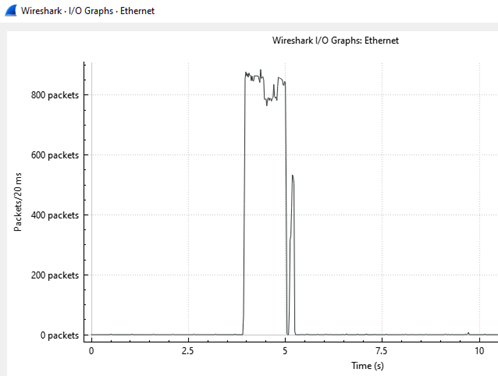

# pfSense Lab

## Objective

### Skills Learned

- 

## Steps

To begin, I am creating two virtual networks, the first for the Windows VM and the second for the Kali Linux VM. The pfSense VM will have two NIC's and act as a router to route traffic between both networks. This is to simulate a real network in a virtual setting. I am using 10.0.2.0/24 for the Windows machine and 192.168.2.0/24 for the Kali Machine. It is important to change the adapter of the VMs to its corresponding networks.

 
After installing pfSense, I configured em0 (LAN) and em1 (LAN) to have IP addresses in the corresponding subnet which was created in the first step.

Now that we have our LAN and WAN, I will manually configure the IPv4 settings on the Windows VM to have an IP address in the LAN subnet and to set the default gateway to the pfSense LAN address.

Those changes will now grant access to the pfSense login page via the default gateway IP address entered into the search bar. Using the default credentials, we can now log in (User: admin / Password: pfsense)

In pfSense, I navigated to System -> Routing -> Gateways to add the LAN gateway associated with the pfSense LAN. The WAN gateway is already configured, so only a configuration for LAN needs to be made.

To ensure that the network is correctfully configured, I will ping the LAN and WAN interfaces from the Windows machine.

On the Kali Linux machine, I will add the default gateway of the pfSense WAN address. 

That is all for setting the network up. When attempting a ping of the Windows Machine from Kali Linux, it will fail because pfSense denies all traffic by default. 

In order to allow traffic between the two machines, we have to create a firewall rule. In this rule, I specify that all traffic from the address 192.168.2.5 (Kali Linux) should be allowed to pass. I also chose WAN for the interface.

Now we can try the ping again to see if the firewall rule is allowing traffic from Kali Linux to be sent to the Windows machine.

There is now a working connection between the Windows and Kali Linux machines, so I am going to simulate a Denial of Service (DoS) attack on the Windows VM and how to block that attack with pfSense. I am using a network tool called "hping3" that allows you to send custom packets, useful for testing firewall rules. The command I am using is "hping3 --flood -S -p 80 (Windows IP)" to flood the Windows machine with SYN packets on port 80. 

After starting the SYN flood, I started a packet capture on the Windows machine to analyze the traffic. I first checked the Conversations tab, which shows the traffic between Windows and Kali Linux and how many packets were sent/received. As you can see below, nearly all of the traffic is from the Kali Linux machine (48k packets) which would be an immediate red flag in an enterprise environment. 

The next thing I want to check out is the Protocol Hierarchy Statistics. This shows what protocols are involved in the packet capture and how much data transmission is in each one. The picture shows that all of this traffic is from TCP packets.

The I/O graph shows when the bulk of traffic was received. The peak in traffic from the DoS attack can be clearly seen below.

Now that we have gathered some evidence, we can quickly discover what kind of attack this is. Based off the unusual amount of TCP packets which are being received and not sent, it is clear that the TCP three-way-handshake is being disrupted. When the Windows machine receives the spoofed SYN packets, it sends the reply message (SYN-ACK), waiting for a reply (ACK) from a host that doesn't exist. To better observe SYN packets, we can use the filter used in the picture below. The high amount of SYN packets with little variance in time proves that this is a SYN flood attack. 

After detecting this attack, we can now create a firewall rule to block traffic from the malicous address. I input the source and destination IP addresses of the Windows and Kali Linux machine, specifying to block the traffic, and setting the rule's name to "Block SYN Flood".

I then tested the SYN flood attack again with Wireshark open, showing that no traffic frrom the Kali Linux machine was being received. In pfSense, we can check the firewall logs, which shows the malicious traffic being blocked by the newly created rule.

